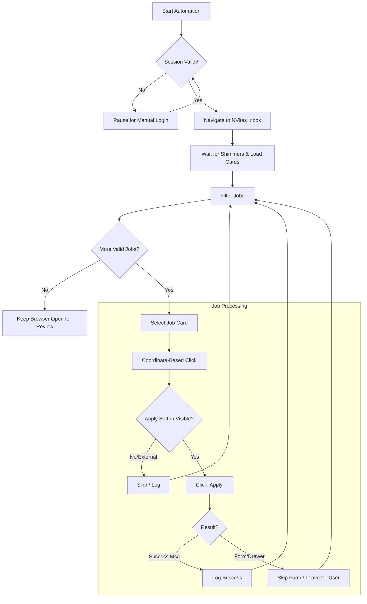

# 🤖 Naukri NVites Automation

A robust, production-grade Python automation tool powered by **Playwright** to streamline the job application process on the Naukri.com "NVites" platform. This tool intelligently navigates your inbox, filters out noise (ads, applied jobs), and applies to relevant opportunities automatically.


---

## 🌊 Workflow Architecture



## ✨ Key Features

- **🧠 Smart Filtering**: Automatically ignores "Sponsored" ads, "Become a Pro" widgets, and jobs you have **already applied** to.
- **💾 Persistent Sessions**: Uses a persistent browser context (`user_data_dir`) to save cookies and local storage, avoiding repetitive logins and CAPTCHAs.
- **🖱️ Human-Like Interaction**: Utilizes coordinate-based mouse movements and clicks to bypass SPA (Single Page Application) event suppression and bot detection.
- **🛡️ Resilience**: Handles dynamic page loads, chatbot overlays, and network delays gracefully.
- **⏰ Scheduled Execution**: Pre-configured batch file to run daily via Windows Task Scheduler.

---

## 🛠️ Installation & Setup

### Prerequisites
- Python 3.8 or higher
- Windows OS (for the batch file schedule)

### 1. Clone & Setup
```bash
# Navigate to project folder
cd C:\Temp_data\automate_N

# Create Virtual Environment
python -m venv venv

# Activate Environment
.\venv\Scripts\activate

# Install Dependencies
pip install playwright
playwright install
```

### 2. First Run (Login)
The first time you run the script, you must log in manually.
```bash
python naukri_automation.py
```
1. The browser will open.
2. Log in to your Naukri account.
3. Solve any CAPTCHAs.
4. Once logged in, the script will capture the session cookies in the `./user_data` folder for future runs.

---

## 🚀 Usage

### Manual Run
Simply execute the Python script:
```powershell
.\venv\Scripts\python.exe naukri_automation.py
```

### Scheduled Run (Daily at 11:30 PM)
The project includes a `run_daily.bat` file configured for the Windows Task Scheduler.

**To verify the task:**
```powershell
schtasks /Query /TN "NaukriAutomation"
```

**To run the task manually:**
```powershell
schtasks /Run /TN "NaukriAutomation"
```

---

## 📂 Project Structure

| File / Directory | Description |
| :--- | :--- |
| `naukri_automation.py` | The core Python automation logic. |
| `run_daily.bat` | Batch script wrapper for the Task Scheduler. |
| `user_data/` | Directory storing browser session/cookies (DO NOT DELETE). |
| `venv/` | Python virtual environment. |
| `PROJECT_DOCUMENTATION.md` | Technical deep-dive and selector reference. |

---

## 🔧 Troubleshooting

**Q: The script clicks but nothing opens.**
*A: The script uses coordinate clicking. Ensure the window is focused and not obscured by other windows.*

**Q: It says "Already Applied" for new jobs.**
*A: Naukri sometimes caches status. The script trusts the "Applied" tag in the job card. Check if the tag is genuinely present.*

**Q: Chatbot blocked the click.**
*A: The script attempts to close `.chatbot_Overlay`. If a new popup style appears, update the selector in the `chatbot_close` logic.*

---

*Generated by Gemini Agent*
